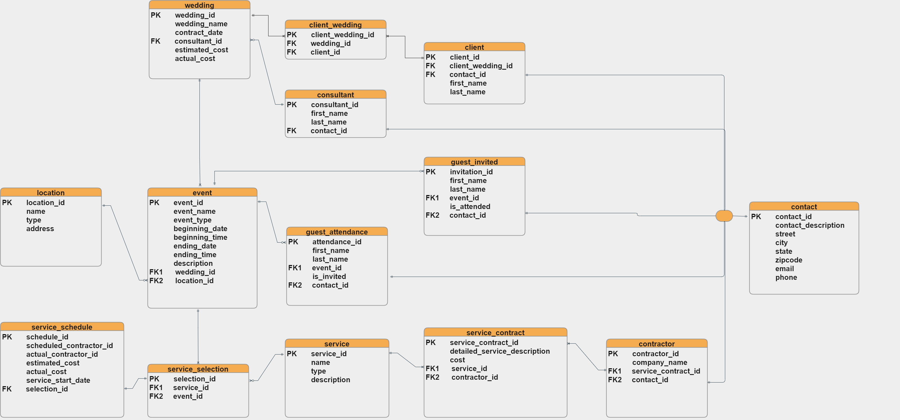

# Enterprise Database Design

Insight drawn from data is crucial to decision making within a business concern. It then follows that every business should have a store for its data. Databases can be used for storage, analytical as well as transactional purposes. For the business in question (Treasure House**), I was given the task of designing a database which would be used for the storage of relevant data on their clients, suppliers and services. 

In the design of the database the first step is usually to conduct a thorough analysis of the enterprise in question. Such analysis provides a view of the underlying business logic governing its operations. [Click here to read the business logic of Treasure House](Business%20Logic.md)

After the analysis is concluded. The next step is representing the business logic with an Entity Relational Data Model (ERD).

The ER model is used as a tool to design relational databases. In the ER model, entities are objects that exist independently of any other entities in the database. The building blocks of an ER diagram are entities and attributes. 

An entity can be a noun: person, place or thing. In an ER diagram, an entity is drawn as a rectangle. Entities have attributes which are the data elements that characterize the entity. Attributes tell us more about the entity. In an ER diagram, attributes are drawn as ovals. 

#### ENTITY RELATIONSHIP DATA MODEL (1st iteration)

 

#### ENTITY RELATIONSHIP DATA MODEL (2nd iteration)

 

#### ENTITY RELATIONSHIP DIAGRAM 

 
 

 

## ** For the purpose of data protection, all names of persons and business entities have been changed to fictional ones.
