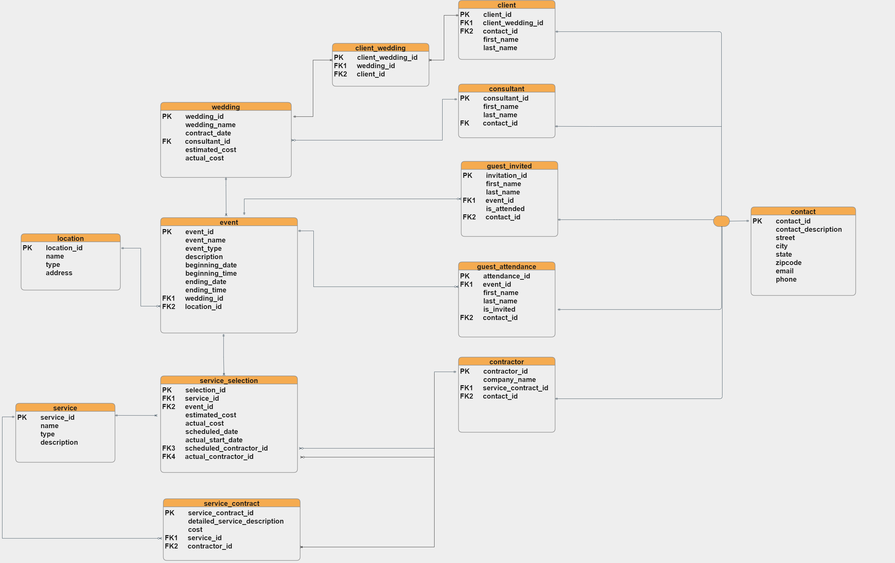
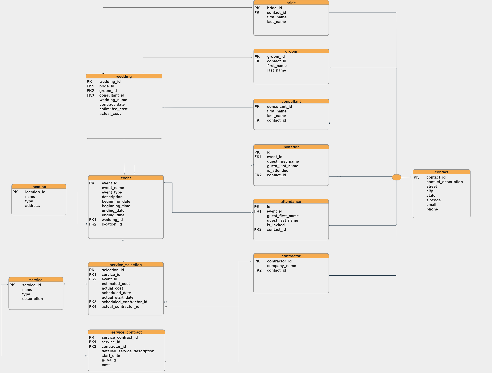

# Database Design

### Introduction
Insight drawn from data is crucial to decision making within a business concern. Every business should have a store for its data. Databases can be used for storage of business data and transactions as well as for conducting analyses and reports. For the business in question (Treasure House**), the database would be used for the storage of client data, contract data of suppliers and services.

### Design process

#### Business rules.
In the design of the database the first step is usually to conduct a thorough analysis of the enterprise in question. Such analysis provides a view of the underlying business rules governing its operations. The screenshot below shows some of the business rules followed in this project.

 [Here's the full list of business rules of Treasure House](business_rules.md)

#### Entity relationship
After the analysis is concluded to yield the business rules, we can represent the findings with an Entity Relational Data Model (ERD).
The ER model is used as a tool to design relational databases. In the ER model, entities are objects that exist independently of any other entities in the database. The building blocks of an ER diagram are entities and attributes.

An entity can be a noun: person, place or thing. In an ER diagram, an entity is drawn as a rectangle. Entities have attributes which are the data elements that characterize the entity. Attributes tell us more about the entity. In an ER diagram, attributes are drawn as ovals.

#### Entity Relationship Data Model
#### (1st iteration)

 

#### (2nd iteration)

 

#### Relational Schema
Relational schema refers to the structure of data within a domain. It is the blueprint of a database which outlines the way data is organised into tables.

#### (1st iteration)

#### (2nd iteration)

#### (3rd iteration)

 
 

 

### Tools:
* PostgreSQL
* Diagrams.net (formerly known as Draw.io)

#### ** For the purpose of data protection, all names of persons and business entities have been changed to fictional ones.
